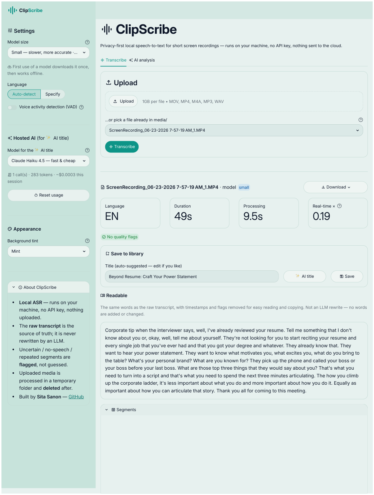

# 🎙️ ClipScribe — Local ASR

**Turn short screen recordings into faithful, timestamped, exportable transcripts — entirely
on your own machine.** A privacy-first **local automatic speech recognition (ASR)** app for
short video/audio clips (especially iPhone `.MOV`/`.MP4` screen recordings), built on
[`faster-whisper`](https://github.com/SYSTRAN/faster-whisper) with a Streamlit UI.


> It is **not** an LLM, RAG, agent, or multimodal system — it's a deterministic
> media-processing + ASR inference pipeline. The raw transcript is the source of truth and is
> never rewritten by an LLM.

## 🚀 What it does

1. 📥 **Upload** a short screen recording or audio clip (`.mov .mp4 .m4a .mp3 .wav`) — iPhone `.MOV` friendly
2. ✅ **Validate** the file (type, size, and a readable audio stream) with clear errors
3. 🎙️ **Transcribe** locally with faster-whisper — **no API key, nothing uploaded**
4. ⏱️ **Review** a raw, timestamped transcript (Readable / Segments / Timestamped views)
5. ⚠️ **Flag** low-confidence, no-speech, and repeated/looping segments — suspicious output is *flagged*, never invented
6. ⬇️ **Export** as **TXT, JSON, SRT, VTT**
7. 🔖 **Save** transcripts to a local library to reopen, re-export, or delete later
8. ✨ **(Optional) AI title** — name a saved transcript with one opt-in hosted call (the only cloud touch)

## 📸 Demo


### Home (after a transcription)


> **Why it exists:** useful advice is often trapped in short-form video audio. The old
> workaround — playing a clip on one phone while Apple Notes transcribed it on another — was
> slow and missed the start. ClipScribe removes that friction, locally and privately.

## 📑 Tabs & views

| Tab / view | Description |
|---|---|
| 🎙️ Transcribe | Upload, settings, progress, transcript review, downloads, and the saved library |
| ✨ AI analysis | Placeholder for the planned local-first AI layer (see [Roadmap](#roadmap)) |
| 📖 Readable | Clean flowing prose — shown first (same words, timestamps removed; not an LLM rewrite) |
| 🧩 Segments | Sortable table with per-segment quality flags (collapsible) |
| ⏱️ Timestamped | The raw timestamped source transcript (collapsible) |

## 💡 How to use it

1. Run `streamlit run app.py`
2. **Upload** a clip (or pick one already in `media/`)
3. In the sidebar choose **model size** (Small is the default), language auto-detect/override, and optional **VAD**
4. Click **Transcribe**
5. Read the **Readable** transcript; expand **Segments**/**Timestamped** and replay any flagged spots by timestamp
6. **Download** TXT/JSON/SRT/VTT, or **Save** to your local library

## ⚙️ Setup

### Prerequisites

- 🐍 Python 3.11+
- 🔑 *(Optional)* an [Anthropic API key](https://console.anthropic.com/) — only for the ✨ AI-title button

### Install

```bash
git clone https://github.com/codedroid404/clipscribe.git
cd clipscribe
source setup.sh        # creates .venv, installs deps, scaffolds .env
```

<details><summary>…or set up manually</summary>

```bash
python3 -m venv .venv && source .venv/bin/activate
python -m pip install -U pip
pip install -e ".[dev]"
cp .env.example .env   # optional — only for the ✨ AI title
```
</details>

The first transcription downloads the chosen Whisper model **weights** once (cached under
`~/.cache/huggingface`). No media or transcript ever leaves your machine.

### Run

```bash
streamlit run app.py
```

*(Optional)* To enable the ✨ AI-title button, add your `ANTHROPIC_API_KEY` to `.env`
(gitignored). Without a key, transcription works fully and the button is simply disabled.

## 🧪 Testing

```bash
ruff check . && pytest -q          # lint + tests
python scripts/evaluate.py --models base small   # runtime/RTF benchmark
```

✅ **38 tests** — unit + integration covering media validation, audio probing, diagnostics
(low-confidence / no-speech / repetition), TXT/JSON/SRT/VTT exporters, temp-file lifecycle,
the SQLite library, the WER helper, and the AI-title helper (with a fake provider — no key needed).

## 🗂️ Project Structure

```
clipScribe/
├── app.py                      # Streamlit UI — upload, transcribe, review, export, library
├── src/clipscribe/
│   ├── media.py                # Validation + audio-stream probing (PyAV; no system ffmpeg)
│   ├── transcriber.py          # faster-whisper model loading + ASR inference
│   ├── diagnostics.py          # Low-confidence / no-speech / repetition flags
│   ├── exporters.py            # TXT / JSON / SRT / VTT serialization
│   ├── tempfiles.py            # Randomized temp lifecycle + cleanup on success/failure
│   ├── service.py              # Pipeline orchestration (validate → transcribe → diagnose → export)
│   ├── models.py               # Typed transcript / segment / media contracts
│   ├── storage.py              # SQLite saved-transcript library (save / list / open / delete)
│   ├── llm.py                  # Optional hosted call for the ✨ AI-title only (opt-in)
│   └── cli.py                  # Command-line transcription
├── tests/
│   ├── unit/                   # media, diagnostics, exporters, tempfiles, storage, llm, verify
│   └── integration/            # service pipeline
├── docs/
│   ├── ClipScribe_Project_Plan_v2.pdf   # the spec this was built from
│   ├── evaluation/EVALUATION.md
│   └── validation/             # per-milestone review records (M0–M6)
├── scripts/                    # evaluation harness
├── static/                     # self-hosted Inter font
├── .streamlit/config.toml      # theme + upload limit
├── setup.sh                    # one-command env setup (venv + deps + .env)
├── review.sh                   # one-command lint + tests + app boot + privacy check
├── pyproject.toml
├── CLAUDE.md
├── CHANGELOG.md
└── README.md
```

## 🛠️ Tech Stack

| Component | Tool |
|---|---|
| 🖥️ UI | Streamlit |
| 🎙️ ASR | faster-whisper (CTranslate2, CPU/int8) |
| 🎞️ Media decode | PyAV (bundled libav — no system `ffmpeg`) |
| 📦 Exports | TXT / JSON / SRT / VTT |
| 🗄️ Library | SQLite (stdlib) |
| 📊 Evaluation | jiwer (WER) |
| 🧪 Testing | pytest + Ruff |
| ⚙️ Config | python-dotenv + Streamlit theme |
| ✨ Optional LLM | Anthropic Claude (AI-title only) |

## 🔒 Privacy & Trust

- **No API key required for transcription.** Media and transcripts are never uploaded by the
  core workflow; the only network access is a one-time Whisper weight download.
- `media/`, `transcripts/`, `data/`, and `.env` are gitignored; filenames and transcript
  content are not logged.
- The raw ASR transcript is preserved as-is — no LLM guesses inaudible speech or rewrites output.
- The **only** outbound feature is the optional ✨ AI-title (one hosted call, behind your own
  key, model-selectable, with a session cost meter).

## ⚠️ Limitations

- Whisper can emit plausible text during silence, music, or unclear audio. ClipScribe
  mitigates, detects, and **flags** this but does **not** claim hallucinations are eliminated.
- The quality flags are **heuristics**, not calibrated accuracy. `avg_logprob` is a
  model-certainty signal (closer to zero = more certain), not an accuracy percentage.
- Formal WER is deferred until a human-validated reference transcript exists.

<a id="roadmap"></a>

## 🗺️ Roadmap

The MVP is the local ASR tool above. The planned next milestone is a **local-first
AI-analysis layer** — ask grounded, cited questions about your *own* saved transcripts, with
retrieval on-device and only the assembled prompt (never your media) sent to an optional,
consent-gated provider. The in-app **AI analysis** tab is a placeholder today, and the ✨
AI-title is a first taste. See the [project plan](docs/ClipScribe_Project_Plan_v2.pdf) (§14)
for the full roadmap.

## 👤 Author

**Sita Sanon** — [LinkedIn](https://www.linkedin.com/in/sita-sanon-a15775269/) · MIT License
